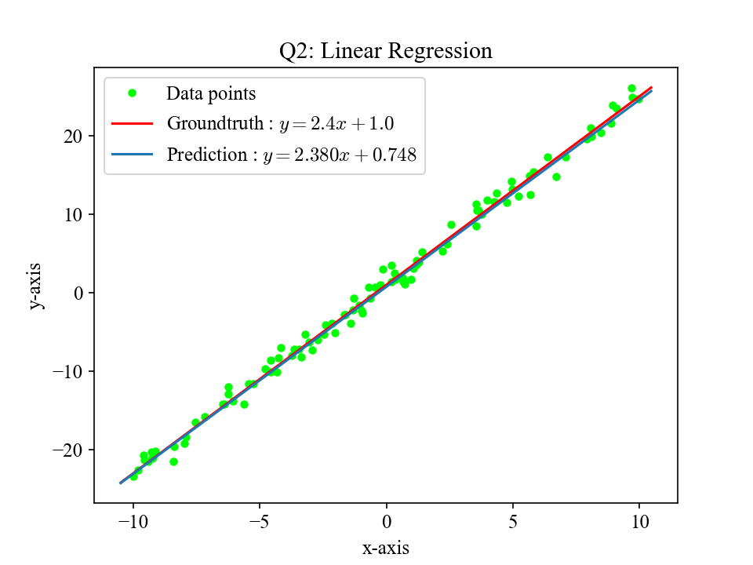

# 2021 Training Courses

## Q1

Deadline: 2021-08-13

1. 設計一個多項式函數類別 `Polynomial` 和變數類別 `Variable`，支援以下功能：
    - 計算多項式函數
    - 對多項式函數進行微分
2. 實作 `plot_polynomial(file, function, p_x, x, formula)`，輸出一張 png 檔：
    - 畫出多項式函數圖形
    - 給定一個點，畫出經過該點的多項式函數的切線
    - 參數：
        - `file`: 輸出的檔案名稱
        - `function`: 多項式函數的 instance
        - `p_x`: 點坐標
        - `x`: 圖表的 x 軸
        - `formula`: 數學式描述

### Packages

- NumPy
- Matplotlib
- pytest

### Prototype

In `libs/functional.py`:

```python
from typing import List, Union

import numpy as np


class Variable:

    def __init__(self, value=None):
        self.value = value
        self.grad = None


class Polynomial:

    def __init__(self, a: List = None):
        self.a = np.array(a)

    def __call__(self, x: Union[float, np.ndarray]) -> Variable:
        pass
```

In `libs/visualization.py`:

```python
from pathlib import Path

import numpy as np

from libs.functional import Polynomial
from libs.visualization import plot_polynomial


class TestPlotPolynomial:

    def test_plot_polynomial_1(self):
        f = Polynomial(a=[1., 2., 3.])  # 1 + 2x + 3x^2
        file = Path('test_plot_polynomial_1.png')
        x = np.linspace(-4.3, 3.7)
        plot_polynomial(file=file, function=f, p_x=1., x=x, formula='1 + 2x + 3x^2')
        assert file.exists()

    def test_plot_polynomial_2(self):
        f = Polynomial(a=[4., 1., 3., 1.2])  # 4 + x + 3x^2 + 1.2x^3
        file = Path('test_plot_polynomial_2.png')
        x = np.linspace(-2.5, 1.0)
        plot_polynomial(file=file, function=f, p_x=-1., x=x, formula='4 + x + 3x^2 + 1.2x^3')
        assert file.exists()
```

### Test Cases

In `tests/test_functional.py`:

```python
import numpy as np

from libs.functional import Polynomial


class TestPolynomial:

    def test_io(self):
        f = Polynomial(a=[1., 2., 3.])  # 1 + 2x + 3x^2
        assert f(4.).value == 57.
        assert f(5.).value == 86.

    def test_io_array(self):
        f = Polynomial(a=[1., 2., 3.])  # 1 + 2x + 3x^2
        x = np.array([4., 5.])
        y = np.array([57., 86.])
        assert np.all(f(x).value == y)

    def test_grad(self):
        f = Polynomial(a=[1., 2., 3.])  # 1 + 2x + 3x^2
        # gradient: <2 + 6x>
        assert f(4.).grad == 26.
        assert f(5.).grad == 32.
```

In `tests/visualization.py`:

```python

from pathlib import Path

import numpy as np

from libs.functional import Polynomial
from libs.visualization import plot_polynomial


class TestPlotPolynomial:

    def test_plot_polynomial_1(self):
        f = Polynomial(a=[1., 2., 3.])  # 1 + 2x + 3x^2
        file = Path('test_plot_polynomial_1.png')
        x = np.linspace(-4.3, 3.7)
        plot_polynomial(file=file, function=f, p_x=1., x=x, formula='1 + 2x + 3x^2')
        assert file.exists()

    def test_plot_polynomial_2(self):
        f = Polynomial(a=[4., 1., 3., 1.2])  # 4 + x + 3x^2 + 1.2x^3
        file = Path('test_plot_polynomial_2.png')
        x = np.linspace(-2.5, 1.0)
        plot_polynomial(file=file, function=f, p_x=-1., x=x, formula='4 + x + 3x^2 + 1.2x^3')
        assert file.exists()
```

`test_plot_polynomial_1.png`:


`test_plot_polynomial_2.png`:


## Q2

Deadline: 2021-08-20

給定 data
points 
，利用 SGD 解出 linear regression.

1. Linear
   regression model: 
2. 隨機初始化 
3. 計算 MSE
   Loss: \
   
4. 計算參數的 gradients:
    - 
    - 
5. 利用 SGD 更新參數

### Prototype

In `libs/functional.py`:

```python
from typing import Tuple

import numpy as np


def regression_sgd(x, y, num_samples, num_iterations, batch_size, learning_rate) -> Tuple[np.ndarray, np.ndarray]:
    pass
```

In `libs/visualization.py`:

```python
def plot_regression(file, x, y, prediction, groundtruth):
    pass
```

### Test Cases

In `tests/test_functional.py`:

```python
import numpy as np

from libs.functional import regression_sgd


def test_regression_solved_correctly():
    m_gt, b_gt = 2.4, 1.0
    num_samples = 100
    x = np.random.uniform(-10, 10, num_samples)
    noise = np.random.normal(0, 1, num_samples)
    y = m_gt * x + b_gt + noise
    num_iterations = 1000
    batch_size = 10
    learning_rate = 0.001

    m, b = regression_sgd(x, y, num_samples, num_iterations, batch_size, learning_rate)

    assert m.shape == (num_iterations + 1,) and b.shape == (num_iterations + 1,)
    assert np.isclose(m[-1], m_gt, 1e-01)
```

In `tests/visualization.py`:

```python
from pathlib import Path

import numpy as np

from libs.functional import regression_sgd
from libs.visualization import plot_regression


def test_plot_regression():
    m_gt, b_gt = 2.4, 1.0
    num_samples = 100
    x = np.random.uniform(-10, 10, num_samples)
    noise = np.random.normal(0, 1, num_samples)
    y = m_gt * x + b_gt + noise
    num_iterations = 1000
    batch_size = 10
    learning_rate = 0.001

    m, b = regression_sgd(x, y, num_samples, num_iterations, batch_size, learning_rate)
    file = Path('test_plot_regression.png')
    plot_regression(file, x, y, prediction=(m, b), groundtruth=(m_gt, b_gt))

    assert file.exists()
```


